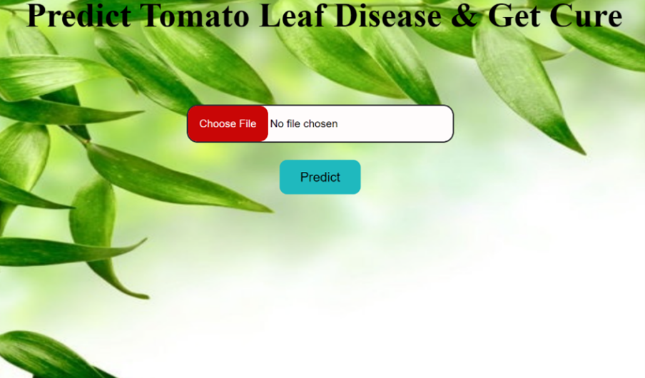
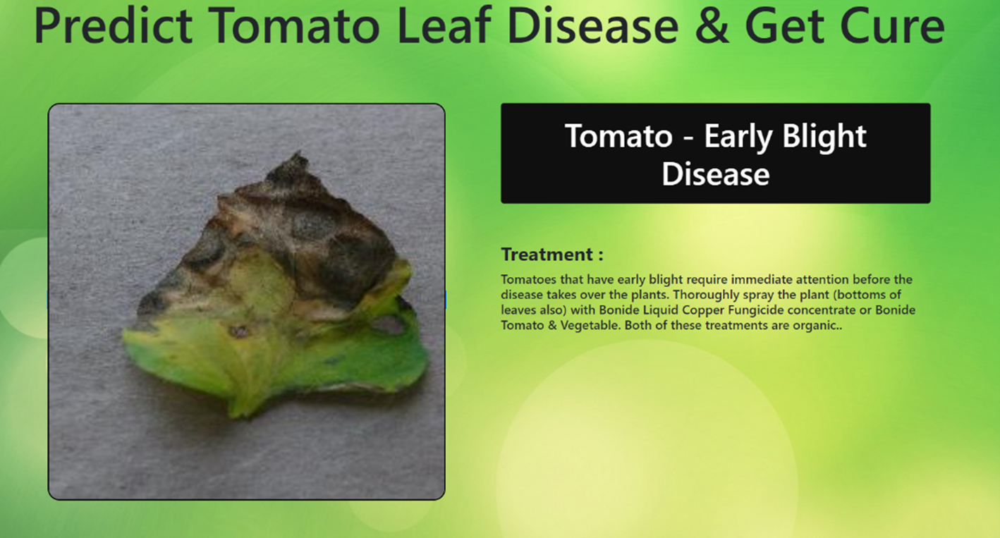

# 🍅 Tomato Leaf Disease Detection🍀

This project uses deep learning to identify various diseases affecting tomato leaves and suggests suitable treatments. With a focus on accuracy and usability, our solution features a robust Convolutional Neural Network (CNN) model and an intuitive web interface.

## 🌟 Project Overview

Tomato crops are susceptible to numerous diseases, which can severely impact yield and quality. This project addresses this problem by providing an automated disease detection system, helping farmers and gardeners protect their crops efficiently.

## ✨ Features

- **Disease Detection**: Utilizes a CNN model to detect nine different tomato leaf diseases with **98% accuracy**.
- **Treatment Recommendations**: Offers appropriate organic and chemical treatments for each identified disease.
- **Web Interface**: A user-friendly interface for uploading leaf images and receiving diagnoses and treatment options.
- **IEEE Paper**: The research paper for this work has been accepted by the IEEE International Conference.

## 🚀 Project Highlights

- **Deep Learning Model**: Built a CNN achieving 98% accuracy in detecting nine tomato diseases and suggesting appropriate cures.
- **Data Augmentation**: Improved model performance using image augmentation techniques, including rotation, scaling, and flipping.
- **Training Data**: Trained the model on an extensive dataset of 400 images per disease type.
- **Web Application**: Developed a web page where users can upload leaf images to detect diseases and get treatment advice.
- **Research Recognition**: A research paper on this project was accepted by the IEEE International Conference.

## 🏗️ Technologies Used

- **Deep Learning**: TensorFlow, Keras
- **Web Development**: HTML, CSS, Flask
- **Database**: SQLite
- **Programming Languages**: Python

## 🧠 Model Architecture
The disease detection model is built using a Convolutional Neural Network (CNN) with the following architecture:

**Input Layer:** Preprocessed images of tomato leaves

**Convolutional Layers:** Extract features from the input images

**Pooling Layers:** Reduce dimensionality while retaining key features

**Dense Layers:** Perform classification to identify diseases

## 🖥️ How to Run

1. **Clone the Repository**:
   ```bash
   git clone https://github.com/yourusername/tomato-leaf-disease-detection.git
2. **Navigate to the Project Directory**
cd tomato-leaf-disease-detection

3. **Install Dependencies**
pip install -r requirements.txt

4. **Run the Web Application**
python app.py

5. **Open Your Browser:** Go to http://localhost:5000 to use the application.

## 📂 Dataset
The model was trained on an unlabeled dataset consisting of 400 images for each of the nine tomato diseases.
Data augmentation techniques were applied to increase the robustness and generalizability of the model.

## Screenshots

### Disease Prediction Interface


### Detected Disease and Cure



## 📈 Results

The model successfully classifies tomato leaf diseases and provides relevant organic treatment suggestions. The diseases include:

1. Early Blight
2. Late Blight
3. Leaf Mold
4. Bacterial Spot
5. Septoria Leaf Spot
6. Target Spot
7. Yellow Leaf Curl Virus
8. Mosaic Virus
9. Spider Mites (Two-Spotted)

## 🔮 Future Work

Enhance Dataset: Collect more labeled images to improve model performance.

Model Optimization: Optimize the model for faster inference and deployment.
